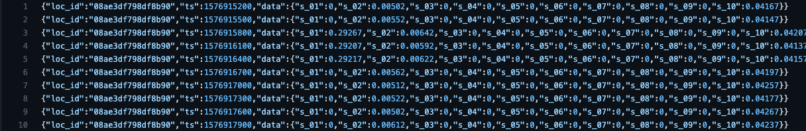
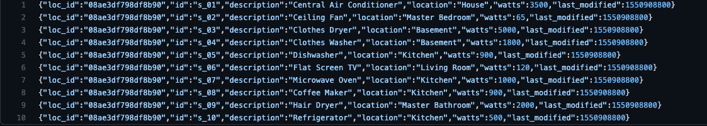
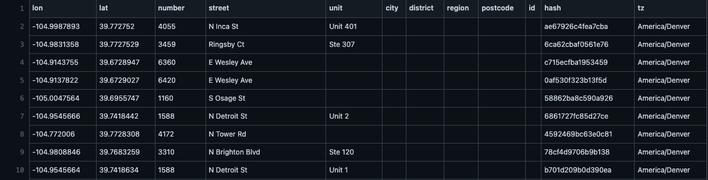
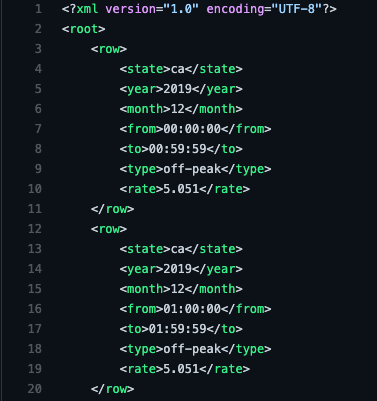

# Residential Electrical Usage Analysis

----
### About

* A hypothetical Smart Hub wirelessly collects detailed electrical usage data from individual, smart electrical receptacles and electrical circuit meters, spread throughout the residence.
* The goal of the Smart Hub is to enable the customers, using data, to reduce their electrical costs.
* The provider benefits from a reduction in load on the existing electrical grid and a better distribution of daily electrical load as customers shift usage to off-peak times to save money.

### Data description and preview

1. **Smart Hub electrical usage data**
   * There are a total of ten electrical sensors whose electrical usage in kilowatt-hours (kW) is recorded and transmitted. Each Smart Hub records and transmits electrical usage for 10 device sensors, 288 times per day (24 hr / 5 min intervals), for a total of 2,880 data points per day, per Smart Hub. 
   * There are two days worth of usage data for the demonstration, for a total of 5,760 data points.
   * 
2. **Smart Hub sensor mappings**
   * Mapping of the sensor column in the usage data e.g. ‘s_01’ to the corresponding actual device e.g., ‘Central Air Conditioner’
   * 
3. **Smart Hub residential locations data**
   * Coordinates, home address and timezone for each residential Smart Hub.
   * 
4. **Electrical rates data**
   * Contains the cost of electricity
   * 